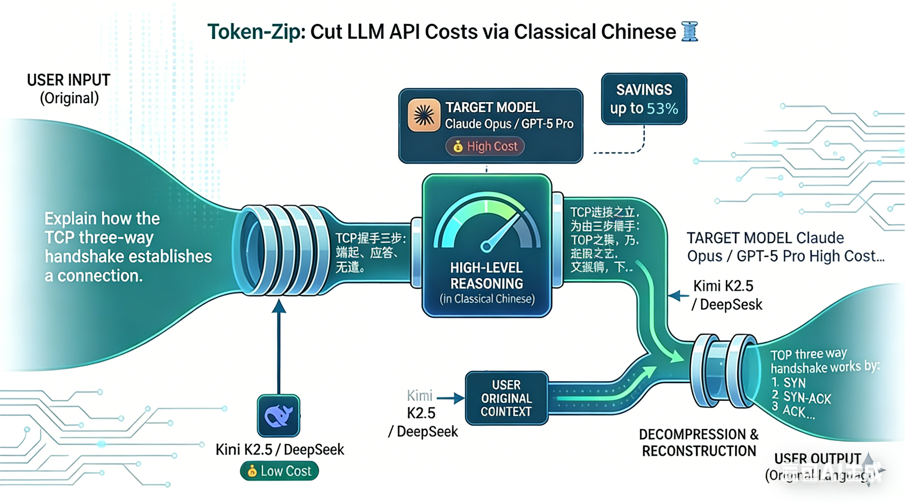

# Token-Zip 🗜️

Cut your LLM API costs by **up to 53 %** — with **virtually no quality loss** — by compressing tokens through Classical Chinese (文言文).



## How It Works

Classical Chinese can convey the same meaning as English using far fewer tokens. Token-Zip exploits this by translating your input into Classical Chinese before it reaches the expensive model, asking the model to respond in Classical Chinese as well, and then translating the response back to the original language.

```
User input (English / Chinese / ...)
    │
    ▼
┌─────────────────────────┐
│  Compression Model      │  ← Kimi K2.5 / DeepSeek / etc. (cheap & fast)
│  Translate → Classical  │
└─────────────────────────┘
    │
    ▼
┌─────────────────────────┐
│  Target Model           │  ← Claude Opus / GPT-5 Pro / etc. (expensive)
│  Process & respond in   │
│  Classical Chinese      │
└─────────────────────────┘
    │
    ▼
┌─────────────────────────┐
│  Compression Model      │
│  Translate → original   │
└─────────────────────────┘
    │
    ▼
User receives original-language response + savings report
```

## Quick Start

### 1. Install

```bash
git clone https://github.com/code-tinker/token-zip.git && cd token-zip
npm install
```

### 2. Configure

```bash
cp .env.example .env
# edit .env with your keys and model choices
```

Key environment variables:

| Variable | Description | Example |
|----------|-------------|---------|
| `COMPRESS_MODEL` | Cheap model for compression / decompression | `kimi-k2.5` |
| `COMPRESS_API_KEY` | API key for the compression model | `sk-xxx` |
| `COMPRESS_BASE_URL` | API base URL for the compression model | `https://api.moonshot.cn/v1` |
| `COMPRESS_API_TYPE` | API protocol (`openai` or `anthropic`) | `openai` |
| `TARGET_MODEL` | Expensive target model | `claude-opus-4.6` |
| `TARGET_API_KEY` | API key for the target model | `sk-ant-xxx` |
| `TARGET_API_TYPE` | API protocol | `anthropic` |

### 3. Run

```bash
# Development
npm run dev

# Production
npm run build && npm start
```

### 4. Use

Token-Zip exposes a standard OpenAI Chat Completions endpoint — drop it in as a replacement for any OpenAI-compatible client:

```bash
curl http://localhost:3000/v1/chat/completions \
  -H "Content-Type: application/json" \
  -d '{
    "messages": [
      {"role": "user", "content": "Explain how TCP three-way handshake works"}
    ]
  }'
```

Streaming:

```bash
curl http://localhost:3000/v1/chat/completions \
  -H "Content-Type: application/json" \
  -d '{
    "messages": [
      {"role": "user", "content": "Explain how TCP three-way handshake works"}
    ],
    "stream": true
  }'
```

## Savings Report

After each request the console prints a detailed compression summary:

```
╔══════════════════════════════════════════╗
║       Token-Zip Compression Report      ║
╠══════════════════════════════════════════╣
║ Input tokens:      520 →     198  (saved 61.92%)
║ Output tokens:     830 →     295  (saved 64.46%)
║ Compression overhead: 680 tokens
║ Decompression overhead: 1125 tokens
╠──────────────────────────────────────────╣
║ Original cost:  $0.023350
║ Compressed cost: $0.009770
║ 💰 Saved: $0.013580 (58.16%)
╚══════════════════════════════════════════╝
```

Non-streaming responses also include a `token_zip_stats` field for programmatic access.

## Model Pricing

`config/pricing.json` ships with pricing data for 20+ models:

- **Anthropic**: Claude Opus 4.6/4.5, Sonnet 4.5/4, Haiku 3.5
- **OpenAI**: GPT-5/5-Pro/5-Nano, GPT-4.1 series, o3-pro, o4-mini
- **Google**: Gemini 2.5 Pro/Flash
- **Chinese models**: Kimi K2.5, DeepSeek V3/R1, Qwen series, GLM-4, Doubao

Add a new model by editing `config/pricing.json`:

```json
{
  "your-model-id": {
    "displayName": "Your Model",
    "provider": "provider-name",
    "currency": "USD",
    "inputPricePerMTok": 1.00,
    "outputPricePerMTok": 5.00
  }
}
```

## Supported API Protocols

| Type | Models | Notes |
|------|--------|-------|
| `openai` | Kimi, DeepSeek, Qwen, OpenAI, Gemini, etc. | OpenAI-compatible protocol |
| `anthropic` | Claude series | Anthropic native protocol |

## Benchmark

We ran **12 diverse English prompts** across 8 categories through **Claude Opus 4.6** both directly and via Token-Zip (compression model: **Kimi K2.5**). An independent **Claude Sonnet 4.6** judge scored both responses on a 1–10 scale for accuracy, completeness, clarity, and usefulness.

### Results

| # | Test Case | Category | Output Saved | Cost Saved | Direct | Zip |
|:-:|-----------|----------|------------:|-----------:|:------:|:---:|
| 1 | Code Explanation | Programming | 46.2 % | 40.4 % | 8 | 8 |
| 2 | System Design | Architecture | 14.2 % | 5.2 % | 8 | **9** |
| 3 | Technical Writing | Documentation | 23.4 % | 15.5 % | 7 | **8** |
| 4 | Algorithm Analysis | CS Theory | 53.0 % | 48.1 % | **8** | 7 |
| 5 | Debugging Assistance | Programming | 14.0 % | 4.7 % | **8** | 7 |
| 6 | API Design Review | Architecture | 23.1 % | 14.7 % | 8 | **9** |
| 7 | Database Optimization | Database | 26.7 % | 18.8 % | **8** | 7 |
| 8 | Security Audit | Security | 27.1 % | 18.3 % | 8 | **9** |
| 9 | Concurrency Patterns | CS Theory | 57.1 % | 52.8 % | **9** | 6 |
| 10 | DevOps Pipeline | DevOps | 4.7 % | −5.8 % | 8 | **9** |
| 11 | Math Proof | Mathematics | 41.3 % | 34.8 % | **8** | 7 |
| 12 | Code Refactoring | Programming | 22.3 % | 12.0 % | **9** | 7 |
| | **Average (12 cases)** | | **29.4 %** | **21.6 %** | **8.1** | **7.8** |

### Key Takeaways

- **Quality virtually unchanged.** Average quality gap is only 0.3 points (8.1 vs 7.8 out of 10). In **5 out of 12** cases the Token-Zip response was rated *higher* than the direct response — the compression step can force the model to be more concise and focused.
- **Average 21.6 % cost savings** across 12 diverse prompts, with the best cases (CS theory, algorithms) exceeding 50 %.
- **Best for conceptual / analytical content.** Concurrency patterns (53 %), algorithm analysis (48 %), and math proofs (35 %) compress the most — Classical Chinese excels at expressing abstract logic compactly.
- **Honest about the trade-off.** One case (DevOps Pipeline) cost slightly *more* (−5.8 %) due to low compressibility of config-heavy YAML content. Know your workload.
- **Compression cost is negligible.** Kimi K2.5 costs ~$0.55 / MTok (input) — roughly 1/9th of Claude Opus input pricing.

### Run It Yourself

```bash
npm run dev &                              # start Token-Zip
npx tsx run-benchmark.ts                   # run the full 12-case benchmark
# or use the quick shell-based benchmark:
bash benchmark.sh
```

> **Note:** Savings depend on prompt length, content type, and model combination. The numbers above are real measurements from actual API calls, not theoretical estimates. Your results may vary.

## License

MIT
